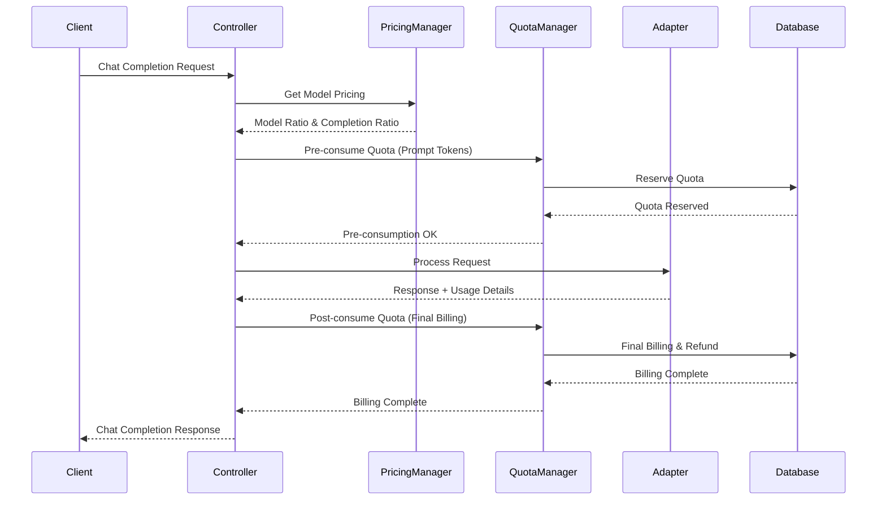
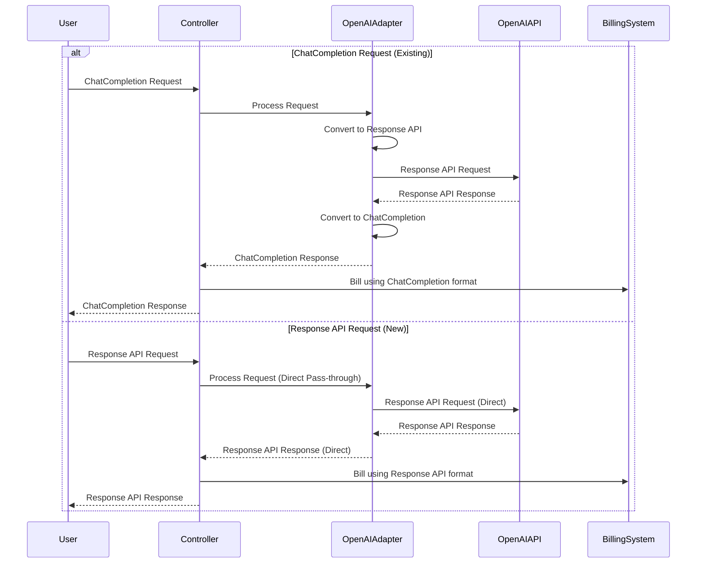

# API Billing

Refs:

- [Billing system](./billing.md)

- [API Billing](#api-billing)
  - [Chat Completion API](#chat-completion-api)
    - [Billing Architecture Overview](#billing-architecture-overview)
    - [Core Billing Components](#core-billing-components)
      - [1. Token-Based Billing Fields](#1-token-based-billing-fields)
      - [2. Additional Cost Components](#2-additional-cost-components)
    - [Billing Calculation Formula](#billing-calculation-formula)
      - [Detailed Breakdown](#detailed-breakdown)
    - [Pricing Resolution System](#pricing-resolution-system)
      - [Layer 1: Channel-Specific Overrides (Highest Priority)](#layer-1-channel-specific-overrides-highest-priority)
      - [Layer 2: Adapter Default Pricing (Second Priority)](#layer-2-adapter-default-pricing-second-priority)
      - [Layer 3: Global Pricing Fallback (Third Priority)](#layer-3-global-pricing-fallback-third-priority)
      - [Layer 4: Final Default (Lowest Priority)](#layer-4-final-default-lowest-priority)
    - [Token Counting Methods](#token-counting-methods)
      - [Text Content](#text-content)
      - [Image Content](#image-content)
      - [Audio Content](#audio-content)
    - [Special Billing Features](#special-billing-features)
      - [1. Structured Output Billing](#1-structured-output-billing)
      - [2. Function Calling Billing](#2-function-calling-billing)
      - [3. Reasoning Model Billing](#3-reasoning-model-billing)
      - [4. Multi-modal Content Billing](#4-multi-modal-content-billing)
    - [Pre-consumption vs Post-consumption](#pre-consumption-vs-post-consumption)
      - [Pre-consumption Phase](#pre-consumption-phase)
      - [Post-consumption Phase](#post-consumption-phase)
    - [Error Handling and Refunds](#error-handling-and-refunds)
      - [Automatic Refund Scenarios](#automatic-refund-scenarios)
      - [Refund Implementation](#refund-implementation)
    - [Usage Logging and Tracking](#usage-logging-and-tracking)
      - [Log Structure](#log-structure)
      - [Billing Metrics Tracked](#billing-metrics-tracked)
    - [Implementation Files](#implementation-files)
      - [Core Billing Logic](#core-billing-logic)
      - [Token Counting](#token-counting)
      - [Structured Output](#structured-output)
      - [Model Pricing](#model-pricing)
  - [OpenAI Response API](#openai-response-api)
    - [Implementation Architecture](#implementation-architecture)
      - [Request Processing Flow](#request-processing-flow)
      - [Dual API Support](#dual-api-support)
    - [Core Implementation Components](#core-implementation-components)
      - [Relay Mode and Routing](#relay-mode-and-routing)
      - [Response API Controller](#response-api-controller)
      - [OpenAI Adapter Enhancements](#openai-adapter-enhancements)
    - [Billing Integration](#billing-integration)
      - [Token Counting and Estimation](#token-counting-and-estimation)
      - [Pre-consumption and Post-consumption](#pre-consumption-and-post-consumption)
      - [Pricing Compatibility](#pricing-compatibility)
    - [Advanced Features Support](#advanced-features-support)
      - [Streaming Implementation](#streaming-implementation)
      - [Structured Output Support](#structured-output-support)
      - [Function Calling Support](#function-calling-support)
    - [API Endpoints and Usage](#api-endpoints-and-usage)
    - [Error Handling and Validation](#error-handling-and-validation)
    - [Implementation Benefits](#implementation-benefits)


## Chat Completion API

The Chat Completion API implements a sophisticated billing system that accurately calculates costs based on multiple factors including token usage, model pricing, completion ratios, and additional features like structured output and function calling.

### Billing Architecture Overview

The Chat Completion API billing follows a **two-phase approach**:

1. **Pre-consumption Phase**: Reserve quota based on estimated prompt tokens
2. **Post-consumption Phase**: Calculate final billing based on actual usage and refund/charge the difference



### Core Billing Components

#### 1. Token-Based Billing Fields

The system tracks and bills for the following token types:

**Primary Token Fields:**

- **`PromptTokens`**: Input tokens from user messages, system prompts, and context
- **`CompletionTokens`**: Output tokens generated by the model
- **`TotalTokens`**: Sum of prompt and completion tokens (for reference)

**Detailed Token Breakdown:**

- **`PromptTokensDetails.TextTokens`**: Text-based prompt tokens
- **`PromptTokensDetails.AudioTokens`**: Audio input tokens (converted to text equivalent)
- **`PromptTokensDetails.ImageTokens`**: Image input tokens (based on image size and detail)
- **`PromptTokensDetails.CachedTokens`**: Cached prompt tokens (may have different pricing)
- **`CompletionTokensDetails.TextTokens`**: Text-based completion tokens
- **`CompletionTokensDetails.AudioTokens`**: Audio output tokens
- **`CompletionTokensDetails.ReasoningTokens`**: Reasoning tokens for reasoning models (like o1)

#### 2. Additional Cost Components

**`ToolsCost`**: Additional charges for special features:

- **Structured Output**: 25% surcharge on completion tokens when using `json_schema` response format
- **Function Calling**: Additional costs for tool usage (model-dependent)
- **Web Search**: Variable costs based on search context size (small/medium/large)

### Billing Calculation Formula

The final quota calculation follows this comprehensive formula:

```text
Final Quota = Base Token Cost + Tools Cost

Where:
Base Token Cost = (PromptTokens + CompletionTokens × CompletionRatio) × ModelRatio × GroupRatio
Tools Cost = Structured Output Cost + Function Call Cost + Web Search Cost
```

#### Detailed Breakdown

**1. Base Token Cost Calculation:**

```go
baseTokenCost = (promptTokens + completionTokens * completionRatio) * modelRatio * groupRatio
```

**2. Structured Output Cost (when applicable):**

```go
structuredOutputCost = math.Ceil(completionTokens * 0.25 * modelRatio)
```

**3. Final Quota:**

```go
finalQuota = baseTokenCost + toolsCost
if modelRatio != 0 && finalQuota <= 0 {
    finalQuota = 1  // Minimum charge
}
```

### Pricing Resolution System

The Chat Completion API uses the **Four-Layer Pricing Resolution** system:

#### Layer 1: Channel-Specific Overrides (Highest Priority)

Custom pricing set by administrators for specific channels:

```json
{
  "model_ratio": { "gpt-4": 0.03, "gpt-3.5-turbo": 0.002 },
  "completion_ratio": { "gpt-4": 3.0, "gpt-3.5-turbo": 1.0 }
}
```

#### Layer 2: Adapter Default Pricing (Second Priority)

Native pricing from channel adapters based on official provider pricing:

```go
// Example from OpenAI adapter
"gpt-4": {
    Ratio:           0.03 * MilliTokensUsd,    // $30 per 1M input tokens
    CompletionRatio: 2.0,                      // 2x multiplier for output tokens
}
```

#### Layer 3: Global Pricing Fallback (Third Priority)

Merged pricing from 13+ major adapters for comprehensive coverage:

- Automatically loaded from OpenAI, Anthropic, Gemini, Ali, Baidu, Zhipu, etc.
- Provides pricing for common models across different channels

#### Layer 4: Final Default (Lowest Priority)

Reasonable fallback pricing:

- **Model Ratio**: 2.5 USD per million tokens
- **Completion Ratio**: 1.0 (no multiplier)

### Token Counting Methods

#### Text Content

Uses tiktoken-based encoding specific to each model:

```go
// Message structure: <|start|>{role}\n{content}<|end|>\n
tokensPerMessage = 3  // For most models
tokensPerName = 1     // If name field is present
totalTokens = messageTokens + contentTokens + 3  // Reply primer
```

#### Image Content

Token calculation based on image dimensions and detail level:

```go
// Low detail: Fixed cost
lowDetailCost = 85 tokens

// High detail: Based on image tiles
numTiles = ceil(width/512) * ceil(height/512)
highDetailCost = numTiles * costPerTile + additionalCost

// Model-specific costs:
// GPT-4o: 170 tokens per tile + 85 base
// GPT-4o-mini: 2833 tokens per tile + 5667 base
```

#### Audio Content

Audio tokens converted to text-equivalent tokens:

```go
// Audio input tokens (per second)
audioPromptTokens = audioSeconds * audioTokensPerSecond * audioPromptRatio

// Audio output tokens
audioCompletionTokens = audioSeconds * audioTokensPerSecond * audioCompletionRatio

// Default rates:
audioTokensPerSecond = 10  // Conservative estimate
audioPromptRatio = 1.0
audioCompletionRatio = varies by model
```

### Special Billing Features

#### 1. Structured Output Billing

When using `response_format` with `json_schema`:

**Detection Logic:**

```go
if request.ResponseFormat != nil &&
   request.ResponseFormat.Type == "json_schema" &&
   request.ResponseFormat.JsonSchema != nil {
    // Apply 25% surcharge on completion tokens
    structuredOutputCost = ceil(completionTokens * 0.25 * modelRatio)
    usage.ToolsCost += structuredOutputCost
}
```

**Cost Impact:**

- Adds 25% surcharge to completion token costs
- Applied only to the completion tokens, not prompt tokens
- Calculated using the same model ratio as base pricing

#### 2. Function Calling Billing

Function calls are billed through the standard token mechanism:

- Function definitions count toward prompt tokens
- Function call responses count toward completion tokens
- No additional surcharge beyond standard token costs

#### 3. Reasoning Model Billing

For reasoning models (like o1-preview, o1-mini):

- **Reasoning tokens** are currently merged into completion tokens by most providers
- Future implementation may separate reasoning token billing
- Currently billed at standard completion token rates

#### 4. Multi-modal Content Billing

**Text + Image:**

```go
totalPromptTokens = textTokens + imageTokens
// Image tokens calculated based on resolution and detail level
```

**Text + Audio:**

```go
totalPromptTokens = textTokens + ceil(audioTokens * audioPromptRatio)
totalCompletionTokens = textTokens + ceil(audioTokens * audioCompletionRatio)
```

### Pre-consumption vs Post-consumption

#### Pre-consumption Phase

**Purpose**: Reserve quota to prevent over-spending
**Calculation**: Based on estimated prompt tokens only

```go
preConsumedQuota = promptTokens * modelRatio * groupRatio
```

**Token Estimation:**

- Counts all message content (text, images, audio)
- Includes system prompts and conversation history
- Does not include completion tokens (unknown at this stage)

#### Post-consumption Phase

**Purpose**: Final billing based on actual usage
**Calculation**: Complete formula with all components

```go
finalQuota = (promptTokens + completionTokens * completionRatio) * modelRatio * groupRatio + toolsCost
```

**Centralized Billing Implementation**: The ChatCompletion API now uses the centralized `billing.PostConsumeQuotaDetailed()` function in `relay/controller/helper.go:postConsumeQuota()` which ensures:

- Consistent billing logic with Response API
- Complete logging with all metadata fields (ElapsedTime, IsStream, SystemPromptReset)
- Proper token quota management via `model.PostConsumeTokenQuota()`
- Unified user and channel quota updates

**Quota Adjustment:**

- If `finalQuota > preConsumedQuota`: Charge additional amount
- If `finalQuota < preConsumedQuota`: Refund difference
- Minimum charge of 1 quota unit if model ratio > 0

### Error Handling and Refunds

#### Automatic Refund Scenarios

1. **Request Failure**: Full refund of pre-consumed quota
2. **Processing Error**: Full refund of pre-consumed quota
3. **Adapter Error**: Full refund of pre-consumed quota

#### Refund Implementation

```go
func ReturnPreConsumedQuota(ctx context.Context, quota int64, tokenId int) {
    if quota > 0 {
        err := PostConsumeTokenQuota(tokenId, -quota)  // Negative amount = refund
        if err != nil {
            logger.Error(ctx, "Failed to return pre-consumed quota: " + err.Error())
        }
    }
}
```

### Usage Logging and Tracking

#### Log Structure

```go
type Log struct {
    UserId:           int
    ChannelId:        int
    PromptTokens:     int     // Actual prompt tokens used
    CompletionTokens: int     // Actual completion tokens generated
    ModelName:        string  // Model used for the request
    TokenName:        string  // API token name
    Quota:            int     // Total quota consumed
    Content:          string  // Additional billing details
}
```

#### Billing Metrics Tracked

- **User-level**: Total quota used, request count
- **Channel-level**: Channel quota consumption
- **Model-level**: Per-model usage statistics
- **Token-level**: API token usage tracking

### Implementation Files

#### Core Billing Logic

- **`relay/controller/text.go`**: Main chat completion controller with pre-consumption
- **`relay/controller/helper.go`**: Post-consumption quota calculation
- **`relay/billing/billing.go`**: Core billing operations and logging
- **`relay/pricing/global.go`**: Four-layer pricing resolution system

#### Token Counting

- **`relay/adaptor/openai/token.go`**: Comprehensive token counting for all content types
- **`relay/controller/helper.go`**: Prompt token estimation

#### Structured Output

- **`relay/adaptor/openai/adaptor.go`**: Structured output cost calculation
- **`relay/adaptor/openai/structured_output_*_test.go`**: Test coverage for structured output billing

#### Model Pricing

- **`relay/adaptor/*/constants.go`**: Adapter-specific model pricing (25+ adapters)
- **`relay/billing/ratio/model.go`**: Legacy pricing compatibility functions

This comprehensive billing system ensures accurate cost calculation for all Chat Completion API features while maintaining backward compatibility and providing transparent pricing across all supported models and providers.

## OpenAI Response API

The OpenAI Response API represents a new interface for generating model responses with enhanced capabilities including stateful conversations, built-in tools, and advanced features. This section documents the **completed implementation** of direct Response API support with full billing integration.

### Implementation Status: ✅ COMPLETE

**Phase 1 Implementation Completed:**

- ✅ **Direct Response API Support**: Users can send requests directly in Response API format to `/v1/responses`
- ✅ **Native Response API Billing**: Dedicated billing path using the same pricing system as ChatCompletion
- ✅ **Streaming Support**: Full streaming compatibility with direct pass-through of Response API events
- ✅ **Backward Compatibility**: No breaking changes to existing ChatCompletion functionality
- ✅ **Feature Parity**: Structured output, function calling, and multi-modal content support

**Dual API Support:**

The system now supports both API formats simultaneously:

- **ChatCompletion API** (`/v1/chat/completions`): Automatic conversion to Response API upstream, with response conversion back to ChatCompletion format
- **Response API** (`/v1/responses`): Direct pass-through without conversion overhead, native Response API responses

### Implementation Architecture

#### Request Processing Flow

The system supports both ChatCompletion and direct Response API requests through a unified architecture:



#### Dual API Support

The implementation provides seamless support for both API formats:

**ChatCompletion API (Existing):**

- Requests sent to `/v1/chat/completions`
- Automatic conversion to Response API for upstream processing
- Response conversion back to ChatCompletion format
- Full backward compatibility maintained

**Response API (New):**

- Requests sent to `/v1/responses`
- Direct pass-through without conversion overhead
- Native Response API response format
- Full feature parity with OpenAI's Response API

### Core Implementation Components

#### Relay Mode and Routing

**Path Detection:** The system detects Response API requests by checking for `/v1/responses` path prefix in `relay/relaymode/helper.go:GetByPath()`

**Routing:** New endpoints added in `router/relay.go`:

- `POST /v1/responses` - Main Response API endpoint
- `GET /v1/responses/:response_id` - Get response (placeholder)
- `DELETE /v1/responses/:response_id` - Delete response (placeholder)
- `POST /v1/responses/:response_id/cancel` - Cancel response (placeholder)

**Controller Dispatch:** The main relay controller in `controller/relay.go:relayHelper()` routes Response API requests to `RelayResponseAPIHelper()`

#### Response API Controller

**Main Handler:** `RelayResponseAPIHelper()` in `relay/controller/response.go` handles Response API requests with full billing integration:

**Key Functions:**

- `getAndValidateResponseAPIRequest()` - Validates incoming Response API requests
- `getResponseAPIPromptTokens()` - Estimates input tokens for pre-consumption
- `preConsumeResponseAPIQuota()` - Reserves quota based on estimated tokens
- `postConsumeResponseAPIQuota()` - Calculates final billing and adjusts quota
- `getResponseAPIRequestBody()` - Prepares request for direct pass-through

**Channel Support:** Currently limited to OpenAI channels (channel type 1) only

**Pricing Integration:** Uses the same three-layer pricing system as ChatCompletion API via `pricing.GetModelRatioWithThreeLayers()`

#### OpenAI Adapter Enhancements

**Request Processing:** The `ConvertRequest()` method in `relay/adaptor/openai/adaptor.go` handles both API formats:

- **Response API requests:** Direct pass-through without conversion
- **ChatCompletion requests:** Automatic conversion to Response API format for upstream processing

**Response Processing:** The `DoResponse()` method routes responses based on relay mode:

- **Direct Response API:** Uses `ResponseAPIDirectHandler()` and `ResponseAPIDirectStreamHandler()` for pass-through
- **Converted ChatCompletion:** Uses `ResponseAPIHandler()` and `ResponseAPIStreamHandler()` for conversion back to ChatCompletion format

**Handler Functions in `relay/adaptor/openai/main.go`:**

- `ResponseAPIDirectHandler()` - Non-streaming Response API pass-through
- `ResponseAPIDirectStreamHandler()` - Streaming Response API pass-through
- `ResponseAPIHandler()` - Response API to ChatCompletion conversion
- `ResponseAPIStreamHandler()` - Streaming Response API to ChatCompletion conversion

### Billing Integration

#### Token Counting and Estimation

**Token Field Mapping:**

| Response API Field      | ChatCompletion Equivalent   | Billing Usage                  |
| ----------------------- | --------------------------- | ------------------------------ |
| `input_tokens`          | `prompt_tokens`             | Pre-consumption calculation    |
| `output_tokens`         | `completion_tokens`         | Post-consumption calculation   |
| `total_tokens`          | `total_tokens`              | Verification and logging       |
| `input_tokens_details`  | `prompt_tokens_details`     | Detailed token breakdown       |
| `output_tokens_details` | `completion_tokens_details` | Reasoning tokens, audio tokens |

**Input Token Estimation:** The `getResponseAPIPromptTokens()` function estimates input tokens using a 4-characters-per-token approximation for text content in the input array and instructions field.

#### Pre-consumption and Post-consumption

**Pre-consumption:** The `preConsumeResponseAPIQuota()` function reserves quota based on:

- Estimated input tokens multiplied by model ratio
- Optional max output tokens if specified in the request
- Minimum quota of 1 if calculation results in zero

**Post-consumption:** The `postConsumeResponseAPIQuota()` function calculates final billing using the same formula as ChatCompletion and follows the **DRY principle** by calling the centralized `billing.PostConsumeQuotaDetailed()` function:

```text
Final Quota = (InputTokens + OutputTokens × CompletionRatio) × ModelRatio × GroupRatio + ToolsCost
```

**Centralized Billing Integration:** Both Response API and ChatCompletion API now use the same centralized billing function `billing.PostConsumeQuotaDetailed()` which ensures:

- Consistent billing logic across all APIs
- Complete logging with all metadata fields (ElapsedTime, IsStream, SystemPromptReset)
- Proper token quota management via `model.PostConsumeTokenQuota()`
- Unified user and channel quota updates

#### Centralized Billing Architecture

**DRY Principle Implementation:** The billing system follows the DRY (Don't Repeat Yourself) principle with a centralized billing architecture:

**Core Billing Functions in `relay/billing/billing.go`:**

- `PostConsumeQuota()` - Simple billing for Audio API (legacy compatibility)
- `PostConsumeQuotaDetailed()` - Detailed billing for ChatCompletion and Response API
- `ReturnPreConsumedQuota()` - Quota refunding on errors

**Unified Billing Flow:**

1. **Pre-consumption:** Both APIs use `model.PreConsumeTokenQuota()` for quota reservation
2. **Post-consumption:** Both APIs call `billing.PostConsumeQuotaDetailed()` for final billing
3. **Logging:** Unified logging with complete metadata (ElapsedTime, IsStream, SystemPromptReset)
4. **Quota Management:** Consistent user and channel quota updates

#### Pricing Compatibility

The Response API billing uses the same **Four-Layer Pricing Resolution** system as ChatCompletion:

1. **Channel-Specific Overrides** (Highest Priority)
2. **Adapter Default Pricing** (Second Priority)
3. **Global Pricing Fallback** (Third Priority)
4. **Final Default** (Lowest Priority)

The pricing is retrieved via `pricing.GetModelRatioWithThreeLayers()` which ensures consistent pricing across both API formats.

**Billing Formula:**

The same billing formula applies with field name mapping:

```text
Final Quota = Base Token Cost + Tools Cost

Where:
Base Token Cost = (InputTokens + OutputTokens × CompletionRatio) × ModelRatio × GroupRatio
Tools Cost = Structured Output Cost + Function Call Cost + Web Search Cost
```

### Advanced Features Support

#### Streaming Implementation

**Direct Pass-through:** The `ResponseAPIDirectStreamHandler()` function in `relay/adaptor/openai/main.go` provides direct streaming support:

- Forwards Response API events directly to clients without conversion
- Accumulates response text from `response.output_text.delta` events
- Extracts usage information from `response.completed` events
- Maintains proper SSE headers and event formatting

**Event Processing:** Supports all Response API streaming event types including text deltas, reasoning summaries, and completion events

#### Structured Output Support

**Detection:** The system detects structured output requests when the Response API request includes `text.format.type: "json_schema"`

**Billing:** Applies the same 25% surcharge on completion tokens as ChatCompletion API for structured output requests

#### Function Calling Support

**Tool Format:** Supports Response API tools format for function calling

**Billing:** Function calls are billed through the standard token mechanism - tool definitions count toward input tokens, and tool responses count toward output tokens

### API Endpoints and Usage

**Main Endpoint:** `POST /v1/responses`

**Basic Request Example:**

```json
{
  "model": "gpt-4",
  "input": [
    {
      "role": "user",
      "content": "Hello, how are you?"
    }
  ]
}
```

**Streaming Request:** Add `"stream": true` to enable streaming responses

**Channel Support:** Currently limited to OpenAI channels (channel type 1) only

### Error Handling and Validation

**Request Validation:**

- Model field validation (required)
- Input array validation (required, non-empty)
- Channel type validation (OpenAI only)

**Quota Management:**

- Pre-consumption quota validation
- Automatic quota refunding on errors via `billing.ReturnPreConsumedQuota()`
- Proper error responses in Response API format

**Upstream Errors:** Pass-through of OpenAI API errors with proper HTTP status codes

### Implementation Benefits

**Native Response API Support:**

- Users can leverage Response API features directly without conversion overhead
- Full feature parity with OpenAI's Response API
- Direct access to Response API-specific capabilities

**Billing Consistency:**

- Same billing logic and pricing system applies regardless of API format
- Accurate cost calculation for all Response API features
- Transparent pricing across all supported models

**Backward Compatibility:**

- No breaking changes to existing ChatCompletion functionality
- Existing automatic conversion remains functional for ChatCompletion requests
- Seamless integration with current infrastructure

**Performance:**

- Direct pass-through eliminates conversion overhead for Response API requests
- Efficient streaming with minimal processing
- Optimized token counting and billing

This implementation successfully provides complete Response API support while maintaining full compatibility with the existing ChatCompletion billing system and ensuring accurate cost calculation for all Response API features.

## Claude Messages API

The Claude Messages API provides full compatibility with Anthropic's Claude Messages API format while maintaining complete billing parity with the existing Chat Completion API. All billing features, pricing layers, and cost calculation methods are fully supported.

### Implementation Architecture

#### Universal Adapter Support

**Conversion Strategy:** The Claude Messages API uses a universal conversion approach:

```
Claude Messages Request → OpenAI Format → Native Adapter Format
```

**Adapter Integration:** All adapters implement the `ConvertClaudeRequest()` method:

- **Anthropic Adapter:** Native Claude Messages support (no conversion needed)
- **All Other Adapters:** Automatic conversion to their native formats via OpenAI intermediate format

**Context Marking:** Requests are marked with standardized context keys for proper response handling:

- `ctxkey.ClaudeMessagesConversion` - Indicates Claude Messages conversion
- `ctxkey.OriginalClaudeRequest` - Stores original request for response conversion

#### Request Processing Flow

**Path Detection:** The system detects Claude Messages API requests by checking for `/v1/messages` path prefix in `relay/relaymode/helper.go:GetByPath()`

**Routing:** New endpoint added in `router/relay.go`:

- `POST /v1/messages` - Main Claude Messages API endpoint

**Controller Dispatch:** The main relay controller in `controller/relay.go:relayHelper()` routes Claude Messages requests to `RelayClaudeMessagesHelper()`

#### Claude Messages Controller

**Main Handler:** `RelayClaudeMessagesHelper()` in `relay/controller/claude_messages.go` handles Claude Messages requests with full billing integration:

**Key Functions:**

- `getAndValidateClaudeMessagesRequest()` - Validates incoming Claude Messages requests
- `getClaudeMessagesPromptTokens()` - Estimates input tokens for pre-consumption
- `preConsumeClaudeMessagesQuota()` - Reserves quota based on estimated tokens
- `postConsumeClaudeMessagesQuota()` - Calculates final billing and adjusts quota
- `getClaudeMessagesRequestBody()` - Prepares request for adapter conversion

**Universal Channel Support:** Works with all supported channel types through adapter conversion

**Pricing Integration:** Uses the same four-layer pricing system as Chat Completion API via `pricing.GetModelRatioWithThreeLayers()`

### Core Billing Components

#### 1. Token-Based Billing Fields

The Claude Messages API supports all standard token-based billing fields with full compatibility:

```go
type Usage struct {
    PromptTokens     int   `json:"prompt_tokens"`
    CompletionTokens int   `json:"completion_tokens"`
    TotalTokens      int   `json:"total_tokens"`
    ToolsCost        int64 `json:"tools_cost,omitempty"`
}
```

**Token Counting Methods:**

- **Text Content:** Uses OpenAI tokenization for accuracy via `openai.CountTokenMessages()`
- **Image Content:** Claude-specific calculation: `tokens = (width × height) / 750`
- **Tools:** Comprehensive tool schema tokenization via `countClaudeToolsTokens()`

#### 2. Additional Cost Components

**Structured Output Billing:** Automatic detection and 25% surcharge for structured output patterns:

```go
func calculateClaudeStructuredOutputCost(request *ClaudeMessagesRequest, completionTokens int, modelRatio float64) int64 {
    // Detects structured output patterns in tool usage
    // Applies 25% surcharge on completion tokens (same as OpenAI)
    if hasStructuredOutput {
        return int64(math.Ceil(float64(completionTokens) * 0.25 * modelRatio))
    }
    return 0
}
```

**Image Processing Costs:** Accurate image token calculation based on Claude's specifications:

```go
func calculateClaudeImageTokens(ctx context.Context, request *ClaudeMessagesRequest) int {
    // Processes all image content blocks in messages and system prompts
    // Uses Claude's formula: tokens = (width × height) / 750
    // Handles base64, URL, and file-based images
    // Provides reasonable estimates when exact dimensions unavailable
}
```

### Billing Calculation Formula

The Claude Messages API uses the same comprehensive billing formula as Chat Completion API:

```
Total Quota = Base Cost + Tools Cost + Structured Output Cost + Image Cost

Where:
- Base Cost = (PromptTokens + CompletionTokens × CompletionRatio) × ModelRatio
- Tools Cost = Calculated during request processing
- Structured Output Cost = CompletionTokens × 0.25 × ModelRatio (if applicable)
- Image Cost = Σ(ImageTokens) × ModelRatio
```

#### Detailed Breakdown

**Pre-consumption Estimation:**

```go
func getClaudeMessagesPromptTokens(ctx context.Context, request *ClaudeMessagesRequest) int {
    // Convert to OpenAI format for accurate text tokenization
    openaiRequest := convertClaudeToOpenAIForTokenCounting(request)

    // Count text tokens
    promptTokens := openai.CountTokenMessages(ctx, openaiRequest.Messages, openaiRequest.Model)

    // Add tool tokens
    if len(request.Tools) > 0 {
        toolsTokens := countClaudeToolsTokens(ctx, request.Tools, openaiRequest.Model)
        promptTokens += toolsTokens
    }

    // Add image tokens using Claude-specific calculation
    imageTokens := calculateClaudeImageTokens(ctx, request)
    promptTokens += imageTokens

    return promptTokens
}
```

**Post-consumption Calculation:**

```go
func postConsumeClaudeMessagesQuota(ctx context.Context, usage *relaymodel.Usage, meta *metalib.Meta, request *ClaudeMessagesRequest, modelRatio float64, completionRatio float64) {
    // Calculate base quota
    baseQuota := int64(math.Ceil((float64(usage.PromptTokens) + float64(usage.CompletionTokens)*completionRatio) * modelRatio))

    // Add structured output cost
    structuredOutputCost := calculateClaudeStructuredOutputCost(request, usage.CompletionTokens, modelRatio)

    // Total quota includes all components
    totalQuota := baseQuota + usage.ToolsCost + structuredOutputCost

    // Use centralized billing system
    billing.PostConsumeQuotaDetailed(ctx, usage, meta, totalQuota, modelRatio, completionRatio, request.Model)
}
```

### Pricing Resolution System

The Claude Messages API uses the same four-layer pricing resolution system:

#### Layer 1: Channel-Specific Overrides (Highest Priority)

Channel-specific pricing overrides stored in database `channels` table:

- `model_ratio` - Channel-specific model pricing multiplier
- `completion_ratio` - Channel-specific completion token ratio

#### Layer 2: Adapter Default Pricing (Second Priority)

Adapter-specific pricing defined in each adapter's pricing configuration.

#### Layer 3: Global Pricing Fallback (Third Priority)

Global model pricing from `relay/pricing/global.go` with comprehensive model coverage.

#### Layer 4: Final Default (Lowest Priority)

Fallback ratios when no specific pricing is found:
- Model Ratio: 1.0
- Completion Ratio: 1.0

### Special Billing Features

#### 1. Multimodal Content Billing

**Image Processing:** Full support for Claude's image formats and pricing:

- **Base64 Images:** Token estimation based on data size with reasonable bounds
- **URL Images:** Default estimation (~853 tokens for typical web images)
- **File Images:** Default estimation using Claude's average image size
- **Multiple Images:** Accurate counting across all message content blocks

**Supported Formats:** JPEG, PNG, GIF, WebP (matching Claude's specifications)

**Size Limits:** Respects Claude's size constraints (8000×8000px max, 2000×2000px for >20 images)

#### 2. Tool Calling Billing

**Comprehensive Tool Support:**

```go
func countClaudeToolsTokens(ctx context.Context, tools []relaymodel.ClaudeTool, model string) int {
    totalTokens := 0
    for _, tool := range tools {
        // Count tool name and description tokens
        totalTokens += openai.CountTokenText(tool.Name, model)
        totalTokens += openai.CountTokenText(tool.Description, model)

        // Count input schema tokens (JSON serialized)
        if tool.InputSchema != nil {
            if schemaBytes, err := json.Marshal(tool.InputSchema); err == nil {
                totalTokens += openai.CountTokenText(string(schemaBytes), model)
            }
        }
    }
    return totalTokens
}
```

#### 3. System Prompt Billing

**Structured System Prompts:** Full support for both string and structured system prompts:

- **String System Prompts:** Direct tokenization
- **Structured System Prompts:** Content block processing with image support
- **Mixed Content:** Text and image blocks in system prompts

### Pre-consumption vs Post-consumption

#### Pre-consumption Phase

**Quota Reservation:** Estimates total cost including all components:

```go
func preConsumeClaudeMessagesQuota(ctx context.Context, request *ClaudeMessagesRequest, meta *metalib.Meta, modelRatio float64) error {
    // Estimate prompt tokens (text + tools + images)
    promptTokens := getClaudeMessagesPromptTokens(ctx, request)

    // Estimate completion tokens based on max_tokens
    estimatedCompletionTokens := request.MaxTokens
    if estimatedCompletionTokens == 0 {
        estimatedCompletionTokens = 1000 // Default estimate
    }

    // Calculate estimated quota with all components
    estimatedQuota := calculateEstimatedQuota(promptTokens, estimatedCompletionTokens, modelRatio, completionRatio)

    // Reserve quota
    return billing.PreConsumeQuota(ctx, meta, estimatedQuota)
}
```

#### Post-consumption Phase

**Accurate Billing:** Uses actual usage data from adapter responses:

```go
func postConsumeClaudeMessagesQuota(ctx context.Context, usage *relaymodel.Usage, meta *metalib.Meta, request *ClaudeMessagesRequest, modelRatio float64, completionRatio float64) {
    // Use centralized billing system with detailed breakdown
    billing.PostConsumeQuotaDetailed(ctx, usage, meta, totalQuota, modelRatio, completionRatio, request.Model)
}
```

### Error Handling and Refunds

#### Automatic Refund Scenarios

The Claude Messages API supports the same automatic refund scenarios as Chat Completion API:

- **Request Validation Failures:** Full refund before processing
- **Adapter Errors:** Refund based on actual processing stage
- **Network Failures:** Full refund if no response received
- **Rate Limit Errors:** Full refund with proper error reporting

#### Refund Implementation

```go
// Automatic refund on errors
if err != nil {
    billing.PostConsumeQuota(ctx, &relaymodel.Usage{}, meta, 0, request.Model)
    return err
}
```

### Usage Logging and Tracking

#### Log Structure

The Claude Messages API uses the same comprehensive logging structure:

```go
type BillingLog struct {
    RequestID        string  `json:"request_id"`
    UserID          int     `json:"user_id"`
    ChannelID       int     `json:"channel_id"`
    Model           string  `json:"model"`
    PromptTokens    int     `json:"prompt_tokens"`
    CompletionTokens int    `json:"completion_tokens"`
    TotalTokens     int     `json:"total_tokens"`
    ToolsCost       int64   `json:"tools_cost"`
    StructuredCost  int64   `json:"structured_output_cost"`
    ImageTokens     int     `json:"image_tokens"`
    ModelRatio      float64 `json:"model_ratio"`
    CompletionRatio float64 `json:"completion_ratio"`
    TotalQuota      int64   `json:"total_quota"`
    APIType         string  `json:"api_type"` // "claude_messages"
}
```

#### Billing Metrics Tracked

**Token Metrics:**
- Prompt tokens (text + tools + images)
- Completion tokens
- Total tokens
- Image-specific token counts

**Cost Metrics:**
- Base model cost
- Tools processing cost
- Structured output surcharge
- Image processing cost
- Total quota consumed

**Operational Metrics:**
- Request processing time
- Adapter conversion overhead
- Error rates and types
- Refund amounts and reasons

### Implementation Files

#### Core Billing Logic

- `relay/controller/claude_messages.go` - Main Claude Messages API controller with full billing integration
- `relay/billing/billing.go` - Centralized billing system (shared with Chat Completion API)
- `relay/pricing/global.go` - Model pricing configuration (shared across all APIs)

#### Token Counting

- `relay/controller/claude_messages.go:getClaudeMessagesPromptTokens()` - Main token estimation
- `relay/controller/claude_messages.go:calculateClaudeImageTokens()` - Claude-specific image token calculation
- `relay/controller/claude_messages.go:countClaudeToolsTokens()` - Tool schema tokenization
- `relay/adaptor/openai/main.go:CountTokenMessages()` - Text tokenization (shared)

#### Adapter Integration

- `relay/adaptor/interface.go` - `ConvertClaudeRequest()` method definition
- `relay/adaptor/*/adaptor.go` - Claude Messages conversion implementation for all adapters
- `common/ctxkey/key.go` - Standardized context keys for conversion tracking

#### Model Pricing

- `relay/pricing/global.go` - Global model pricing with Claude model support
- `relay/pricing/pricing.go` - Four-layer pricing resolution system (shared)
- Database `channels` table - Channel-specific pricing overrides

### Billing Integration Summary

The Claude Messages API provides complete billing parity with the Chat Completion API:

**✅ Full Feature Support:**
- Two-phase billing (pre-consumption and post-consumption)
- Four-layer pricing resolution system
- Comprehensive token counting (text, images, tools)
- Structured output billing with automatic detection
- Multimodal content billing with Claude-specific calculations
- Tool calling cost calculation
- Error handling and automatic refunds

**✅ Universal Compatibility:**
- Works with all supported channel types and adapters
- Maintains existing billing infrastructure
- Uses centralized billing system (`billing.PostConsumeQuotaDetailed()`)
- Preserves all existing pricing configurations

**✅ Accurate Cost Calculation:**
- Claude-specific image token calculation: `tokens = (width × height) / 750`
- Proper tool schema tokenization
- Structured output surcharge detection and application
- Comprehensive usage tracking and logging

**✅ Production Ready:**
- Complete error handling and refund mechanisms
- Detailed usage logging and metrics
- Performance optimized token counting
- Backward compatible with existing infrastructure

This implementation ensures that users of the Claude Messages API receive accurate billing that matches the sophistication and completeness of the existing Chat Completion API billing system.
