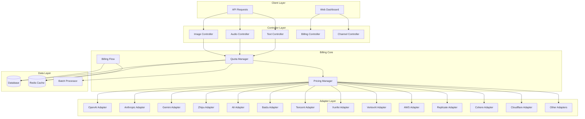
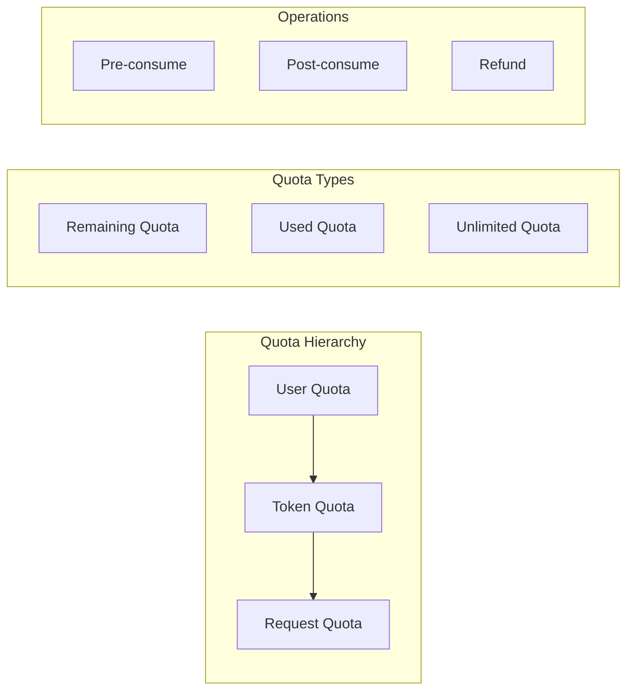
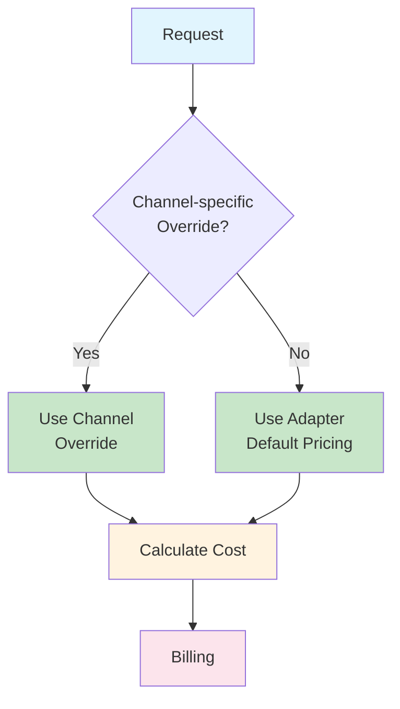
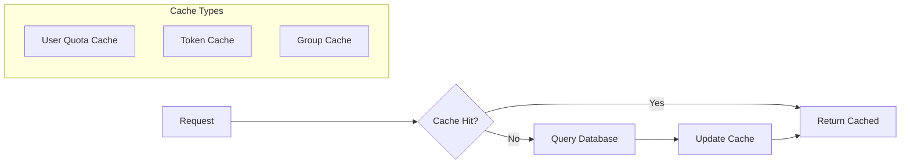
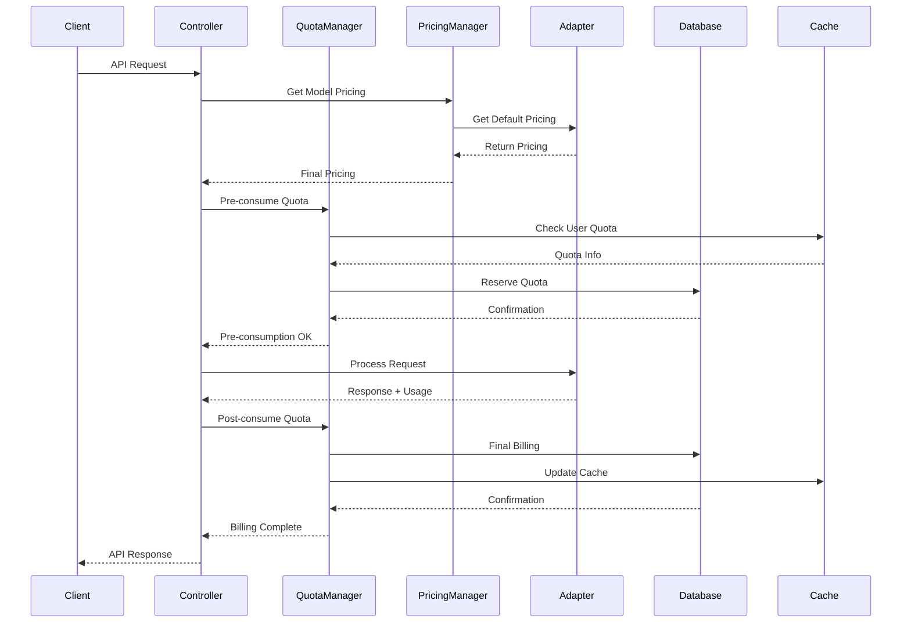
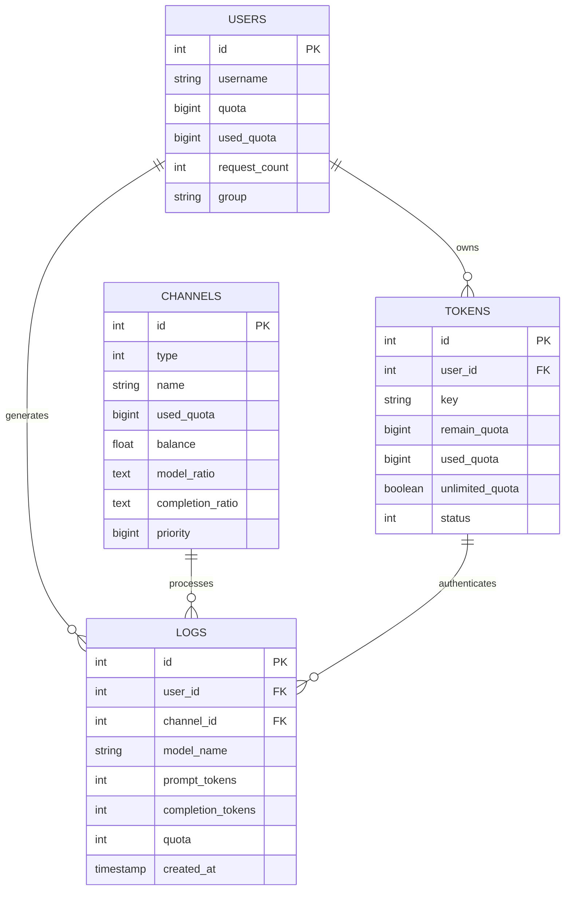
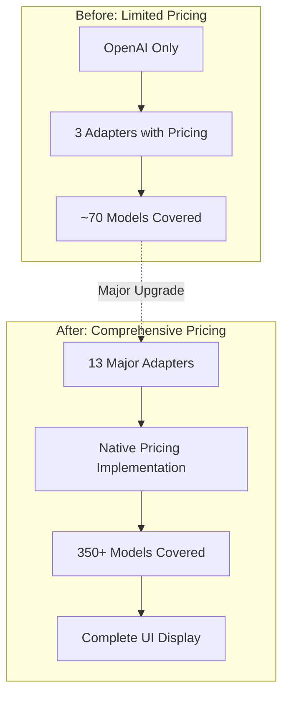
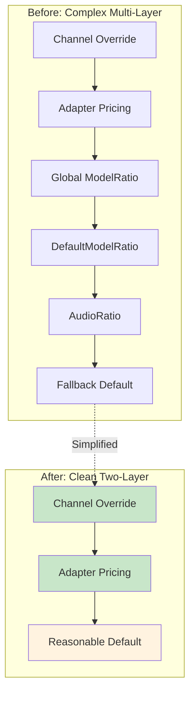

# One-API Billing System Architecture

## Table of Contents

- [One-API Billing System Architecture](#one-api-billing-system-architecture)
  - [Table of Contents](#table-of-contents)
  - [Overview](#overview)
    - [Key Features](#key-features)
  - [System Architecture](#system-architecture)
  - [Core Components](#core-components)
    - [1. Quota Management System](#1-quota-management-system)
      - [Key Files:](#key-files)
    - [2. Pricing System](#2-pricing-system)
      - [Key Files:](#key-files-1)
    - [3. Adapter System](#3-adapter-system)
      - [Adapter Pricing Implementation Status](#adapter-pricing-implementation-status)
  - [Quota Management](#quota-management)
    - [User Quota System](#user-quota-system)
      - [Database Schema (User):](#database-schema-user)
      - [Key Operations:](#key-operations)
    - [Token Quota System](#token-quota-system)
      - [Database Schema (Token):](#database-schema-token)
      - [Token Types:](#token-types)
    - [Caching Strategy](#caching-strategy)
      - [Key Files:](#key-files-2)
  - [Pricing System](#pricing-system)
    - [Pricing Hierarchy](#pricing-hierarchy)
    - [Pricing Constants](#pricing-constants)
    - [Model Pricing Structure](#model-pricing-structure)
    - [Channel-specific Pricing](#channel-specific-pricing)
      - [Database Schema (Channel):](#database-schema-channel)
      - [Key Functions:](#key-functions)
  - [Billing Flow](#billing-flow)
    - [Request Processing Flow](#request-processing-flow)
    - [Pre-consumption Phase](#pre-consumption-phase)
      - [Key Functions:](#key-functions-1)
    - [Post-consumption Phase](#post-consumption-phase)
      - [Key Functions:](#key-functions-2)
    - [Quota Calculation](#quota-calculation)
      - [Text Requests:](#text-requests)
      - [Audio Requests:](#audio-requests)
      - [Image Requests:](#image-requests)
  - [Database Schema](#database-schema)
    - [Core Tables](#core-tables)
      - [Users Table](#users-table)
      - [Tokens Table](#tokens-table)
      - [Channels Table](#channels-table)
      - [Logs Table](#logs-table)
    - [Relationships](#relationships)
  - [API Endpoints](#api-endpoints)
    - [Billing Endpoints](#billing-endpoints)
      - [Get Subscription Info](#get-subscription-info)
      - [Get Usage Info](#get-usage-info)
    - [Channel Pricing Endpoints](#channel-pricing-endpoints)
      - [Get Channel Pricing](#get-channel-pricing)
      - [Update Channel Pricing](#update-channel-pricing)
      - [Get Default Pricing](#get-default-pricing)
    - [Token Management Endpoints](#token-management-endpoints)
  - [Recent Pricing Implementation Improvements](#recent-pricing-implementation-improvements)
    - [Comprehensive Adapter Pricing Implementation](#comprehensive-adapter-pricing-implementation)
      - [Implementation Overview](#implementation-overview)
      - [Key Improvements](#key-improvements)
      - [Technical Implementation Details](#technical-implementation-details)
      - [Provider-Specific Pricing Examples](#provider-specific-pricing-examples)
      - [Migration from DefaultPricingMethods](#migration-from-defaultpricingmethods)
      - [Impact and Benefits](#impact-and-benefits)
      - [Files Modified](#files-modified)
    - [Global Pricing Removal and Clean Architecture](#global-pricing-removal-and-clean-architecture)
      - [Architecture Transformation](#architecture-transformation)
      - [What Was Removed](#what-was-removed)
      - [What Was Preserved](#what-was-preserved)
      - [Benefits Achieved](#benefits-achieved)
  - [Implementation Details](#implementation-details)
    - [Clean Two-Layer Pricing Resolution](#clean-two-layer-pricing-resolution)
      - [Legacy Compatibility](#legacy-compatibility)
    - [Batch Processing](#batch-processing)
      - [Configuration:](#configuration)
      - [Batch Types:](#batch-types)
      - [Key Files:](#key-files-3)
    - [Error Handling and Recovery](#error-handling-and-recovery)
      - [Quota Refund Mechanism:](#quota-refund-mechanism)
      - [Key Files:](#key-files-4)
    - [Structured Output Pricing](#structured-output-pricing)
      - [Key Files:](#key-files-5)
  - [Performance Considerations](#performance-considerations)
    - [Caching Strategy](#caching-strategy-1)
    - [Database Optimization](#database-optimization)
    - [Memory Management](#memory-management)
    - [Monitoring and Metrics](#monitoring-and-metrics)
      - [Key Metrics:](#key-metrics)
      - [Key Files:](#key-files-6)

## Overview

The One-API billing system is a comprehensive quota and pricing management system designed to handle multi-tenant API usage billing across various AI model providers. The system supports both user-level and token-level quota management, channel-specific pricing, and real-time billing calculations.

### Key Features

- **Multi-tier Quota System**: User quotas, token quotas, and unlimited quota support
- **Channel-specific Pricing**: Per-channel model pricing overrides
- **Comprehensive Adapter Pricing**: 13+ channel adapters with native pricing implementations
- **Complete Pricing Coverage**: 350+ models across major AI providers with accurate pricing
- **Real-time Billing**: Pre-consumption and post-consumption quota management
- **Caching Layer**: Redis-based caching for performance optimization
- **Batch Updates**: Configurable batch processing for high-throughput scenarios
- **Zero-Loss Pricing Display**: All completion ratios (including 0) are displayed in the UI

## System Architecture



## Core Components

### 1. Quota Management System

The quota management system operates on multiple levels:



#### Key Files:

- `model/user.go` - User quota management
- `model/token.go` - Token quota management
- `model/cache.go` - Quota caching layer
- `relay/billing/billing.go` - Core billing operations

### 2. Pricing System

The pricing system uses a hierarchical approach with multiple fallback levels:



#### Key Files:

- `relay/billing/ratio/model.go` - Audio/video pricing constants and legacy compatibility functions
- `relay/adaptor/interface.go` - Adapter pricing interface
- `relay/adaptor/*/adaptor.go` - Adapter-specific pricing implementations (13 adapters)
- `model/channel.go` - Channel-specific pricing storage
- `controller/channel.go` - Channel pricing API endpoints

### 3. Adapter System

Each channel adapter implements its own comprehensive pricing logic. As of the latest implementation, 13 major adapters have native pricing support:

```mermaid
classDiagram
    class Adaptor {
        <<interface>>
        +GetDefaultModelPricing() map[string]ModelPrice
        +GetModelRatio(modelName string) float64
        +GetCompletionRatio(modelName string) float64
    }

    class DefaultPricingMethods {
        +GetDefaultModelPricing() map[string]ModelPrice
        +GetModelRatio(modelName string) float64
        +GetCompletionRatio(modelName string) float64
    }

    class OpenAIAdaptor {
        +GetDefaultModelPricing() map[string]ModelPrice
        +GetModelRatio(modelName string) float64
        +GetCompletionRatio(modelName string) float64
    }

    class AnthropicAdaptor {
        +GetDefaultModelPricing() map[string]ModelPrice
        +GetModelRatio(modelName string) float64
        +GetCompletionRatio(modelName string) float64
    }

    class AliAdaptor {
        +GetDefaultModelPricing() map[string]ModelPrice
        +GetModelRatio(modelName string) float64
        +GetCompletionRatio(modelName string) float64
    }

    class GeminiAdaptor {
        +GetDefaultModelPricing() map[string]ModelPrice
        +GetModelRatio(modelName string) float64
        +GetCompletionRatio(modelName string) float64
    }

    class ReplicateAdaptor {
        +GetDefaultModelPricing() map[string]ModelPrice
        +GetModelRatio(modelName string) float64
        +GetCompletionRatio(modelName string) float64
    }

    Adaptor <|-- DefaultPricingMethods
    Adaptor <|-- OpenAIAdaptor
    Adaptor <|-- AnthropicAdaptor
    Adaptor <|-- AliAdaptor
    Adaptor <|-- GeminiAdaptor
    Adaptor <|-- ReplicateAdaptor

    note for Adaptor "13+ adapters with native pricing:\n• OpenAI (54 models)\n• Anthropic (15 models)\n• Zhipu (23 models)\n• Ali (89 models)\n• Baidu (16 models)\n• Tencent (6 models)\n• Gemini (26 models)\n• Xunfei (6 models)\n• VertexAI (34 models)\n• AWS (31 models)\n• Replicate (48 models)\n• Cohere (12 models)\n• Cloudflare (33 models)"
```



#### Adapter Pricing Implementation Status

**✅ Adapters with Native Pricing (13 total)**:

- **OpenAI**: 54 models with comprehensive GPT pricing
- **Anthropic**: 15 models with Claude pricing
- **Zhipu**: 23 models with GLM pricing
- **Ali (Alibaba)**: 89 models with Qwen and other models
- **Baidu**: 16 models with ERNIE pricing
- **Tencent**: 6 models with Hunyuan pricing
- **Gemini**: 26 models with Gemini/Gemma pricing
- **Xunfei**: 6 models with Spark pricing
- **VertexAI**: 34 models with Google Cloud pricing
- **AWS**: 31 models with Bedrock pricing
- **Replicate**: 48 models with image/text generation pricing
- **Cohere**: 12 models with Command pricing
- **Cloudflare**: 33 models with Workers AI pricing

**❌ Adapters Using DefaultPricingMethods (4 remaining)**:

- **Ollama**: Local model hosting (typically free)
- **Coze**: Conversational AI platform
- **DeepL**: Translation service
- **Proxy**: Generic proxy adapter

## Quota Management

### User Quota System

Users have a primary quota that serves as the main billing account:

#### Database Schema (User):

```sql
CREATE TABLE users (
    id INTEGER PRIMARY KEY,
    quota BIGINT DEFAULT 0,           -- Remaining quota
    used_quota BIGINT DEFAULT 0,     -- Total used quota
    request_count INTEGER DEFAULT 0   -- Total request count
);
```

#### Key Operations:

- `IncreaseUserQuota()` - Add quota to user account
- `DecreaseUserQuota()` - Deduct quota from user account
- `GetUserQuota()` - Retrieve current user quota
- `CacheGetUserQuota()` - Cached quota retrieval

### Token Quota System

Tokens can have individual quotas or inherit from user quotas:

#### Database Schema (Token):

```sql
CREATE TABLE tokens (
    id INTEGER PRIMARY KEY,
    user_id INTEGER,
    remain_quota BIGINT DEFAULT 0,    -- Token-specific quota
    used_quota BIGINT DEFAULT 0,      -- Token usage
    unlimited_quota BOOLEAN DEFAULT FALSE  -- Bypass quota checks
);
```

#### Token Types:

1. **Limited Tokens**: Have specific quota limits
2. **Unlimited Tokens**: Bypass quota restrictions
3. **User-inherited Tokens**: Use parent user's quota

### Caching Strategy

The system implements a multi-layer caching strategy for performance:



#### Key Files:

- `model/cache.go` - Caching implementations
- Cache TTL configurations in `model/cache.go`

## Pricing System

### Pricing Hierarchy

The system uses a **clean two-layer pricing hierarchy**:

1. **User Custom Ratio** (Channel-specific overrides) - Highest Priority
2. **Channel Default Ratio** (Adapter's default pricing) - Fallback

**Global pricing maps have been completely removed** for a cleaner, more maintainable architecture.

### Pricing Constants

```go
// Currency and token conversion constants
const (
    QuotaPerUsd     = 500000 // $1 = 500,000 quota
    MilliTokensUsd  = 0.5    // 0.5 quota per milli-token (0.000001 USD * 500000)
    ImageUsdPerPic  = 1000   // 1000 quota per image (0.002 USD * 500000)
    MilliTokensRmb  = 3.5    // 3.5 quota per milli-token (0.000007 RMB * 500000)
    ImageRmbPerPic  = 7000   // 7000 quota per image (0.014 RMB * 500000)
    MilliTokensYuan = 3.5    // 3.5 quota per milli-token (0.000007 Yuan * 500000)
    ImageYuanPerPic = 7000   // 7000 quota per image (0.014 Yuan * 500000)
    TokensPerSec    = 10     // Video tokens per second for video generation models
)
```

### Model Pricing Structure

```go
type ModelPrice struct {
    Ratio           float64 `json:"ratio"`
    CompletionRatio float64 `json:"completion_ratio,omitempty"`
}
```

### Channel-specific Pricing

Channels can override default pricing for specific models:

#### Database Schema (Channel):

```sql
CREATE TABLE channels (
    id INTEGER PRIMARY KEY,
    model_ratio TEXT,        -- JSON: {"model": ratio}
    completion_ratio TEXT    -- JSON: {"model": completion_ratio}
);
```

#### Key Functions:

- `GetModelRatio()` - Retrieve channel model pricing
- `SetModelRatio()` - Update channel model pricing
- `GetCompletionRatio()` - Retrieve completion pricing
- `SetCompletionRatio()` - Update completion pricing

## Billing Flow

### Request Processing Flow



### Pre-consumption Phase

Before processing requests, the system reserves quota:

#### Key Functions:

- `preConsumeQuota()` in `relay/controller/text.go`
- `getPreConsumedQuota()` for quota calculation
- Token validation and quota checking

### Post-consumption Phase

After request completion, final billing is calculated:

#### Key Functions:

- `postConsumeQuota()` in `relay/controller/helper.go`
- `PostConsumeQuota()` in `relay/billing/billing.go`
- Usage logging and metrics recording

### Quota Calculation

Different request types use different calculation methods:

#### Text Requests:

```
quota = (prompt_tokens + completion_tokens * completion_ratio) * model_ratio * group_ratio
```

#### Audio Requests:

```
quota = audio_duration_seconds * audio_tokens_per_second * model_ratio * group_ratio
```

#### Image Requests:

```
quota = image_count * image_cost_per_pic * model_ratio * group_ratio
```

## Database Schema

### Core Tables

#### Users Table

```sql
CREATE TABLE users (
    id INTEGER PRIMARY KEY AUTOINCREMENT,
    username VARCHAR(30) UNIQUE,
    quota BIGINT DEFAULT 0,
    used_quota BIGINT DEFAULT 0,
    request_count INTEGER DEFAULT 0,
    group VARCHAR(32) DEFAULT 'default'
);
```

#### Tokens Table

```sql
CREATE TABLE tokens (
    id INTEGER PRIMARY KEY AUTOINCREMENT,
    user_id INTEGER,
    key CHAR(48) UNIQUE,
    remain_quota BIGINT DEFAULT 0,
    used_quota BIGINT DEFAULT 0,
    unlimited_quota BOOLEAN DEFAULT FALSE,
    status INTEGER DEFAULT 1,
    expired_time BIGINT DEFAULT -1
);
```

#### Channels Table

```sql
CREATE TABLE channels (
    id INTEGER PRIMARY KEY AUTOINCREMENT,
    type INTEGER DEFAULT 0,
    name VARCHAR(255),
    used_quota BIGINT DEFAULT 0,
    balance FLOAT DEFAULT 0,
    model_ratio TEXT,           -- JSON string
    completion_ratio TEXT,      -- JSON string
    priority BIGINT DEFAULT 0
);
```

#### Logs Table

```sql
CREATE TABLE logs (
    id INTEGER PRIMARY KEY AUTOINCREMENT,
    user_id INTEGER,
    channel_id INTEGER,
    model_name VARCHAR(255),
    prompt_tokens INTEGER,
    completion_tokens INTEGER,
    quota INTEGER,
    created_at TIMESTAMP DEFAULT CURRENT_TIMESTAMP
);
```

### Relationships



## API Endpoints

### Billing Endpoints

#### Get Subscription Info

```
GET /dashboard/billing/subscription
GET /v1/dashboard/billing/subscription
```

**Controller**: `controller.GetSubscription()`
**File**: `controller/billing.go`

#### Get Usage Info

```
GET /dashboard/billing/usage
GET /v1/dashboard/billing/usage
```

**Controller**: `controller.GetUsage()`
**File**: `controller/billing.go`

### Channel Pricing Endpoints

#### Get Channel Pricing

```
GET /api/channel/pricing/:id
```

**Controller**: `controller.GetChannelPricing()`
**File**: `controller/channel.go`

#### Update Channel Pricing

```
PUT /api/channel/pricing/:id
```

**Controller**: `controller.UpdateChannelPricing()`
**File**: `controller/channel.go`

#### Get Default Pricing

```
GET /api/channel/default-pricing?type=:channelType
```

**Controller**: `controller.GetChannelDefaultPricing()`
**File**: `controller/channel.go`

**Response Format**:

```json
{
  "success": true,
  "message": "",
  "data": {
    "model_ratio": "{\"model1\": 0.001, \"model2\": 0.002}",
    "completion_ratio": "{\"model1\": 1.0, \"model2\": 3.0}"
  }
}
```

**Key Implementation Details**:

- Converts channel type to API type using `channeltype.ToAPIType()`
- Includes ALL completion ratios (including 0) for complete pricing transparency
- Returns comprehensive pricing for all models supported by the adapter

### Token Management Endpoints

Token management is handled through existing user and admin endpoints with quota operations integrated.

## Recent Pricing Implementation Improvements

### Comprehensive Adapter Pricing Implementation

As of the latest update, the system has undergone a major overhaul to implement comprehensive pricing across all major channel adapters. This addresses the previous issue where only OpenAI channels displayed pricing information.

#### Implementation Overview



#### Key Improvements

1. **Expanded Adapter Coverage**: From 3 to 13 adapters with native pricing
2. **Model Coverage**: From ~70 to 350+ models with accurate pricing
3. **UI Consistency**: All channel edit pages now display pricing information
4. **Pricing Accuracy**: Based on official provider documentation
5. **Complete Data Display**: All completion ratios (including 0) are shown
6. **Global Pricing Removal**: Eliminated complex multi-layer fallbacks for clean two-layer architecture

#### Technical Implementation Details

**Adapter Pricing Structure**:

```go
// Each adapter implements comprehensive pricing
func (a *Adaptor) GetDefaultModelPricing() map[string]adaptor.ModelPrice {
    const MilliTokensUsd = 0.000001

    return map[string]adaptor.ModelPrice{
        "model-name": {
            Ratio:           0.001 * MilliTokensUsd,  // Input pricing
            CompletionRatio: 3.0,                     // Output multiplier
        },
        // ... comprehensive model coverage
    }
}
```

**Channel Type Mapping Fix**:

```go
// Fixed the channel type to API type conversion
apiType := channeltype.ToAPIType(channelType)
adaptor := relay.GetAdaptor(apiType)
```

**Complete Pricing Display**:

```go
// Include ALL completion ratios (including 0)
for model, price := range defaultPricing {
    modelRatios[model] = price.Ratio
    completionRatios[model] = price.CompletionRatio  // No filtering
}
```

#### Provider-Specific Pricing Examples

**Ali (Alibaba Cloud)**: 89 models

- Qwen models: ¥0.0003-¥0.0024 per 1K tokens
- DeepSeek models: ¥0.0001-¥0.008 per 1K tokens
- Embedding models: ¥0.00005 per 1K tokens

**AWS Bedrock**: 31 models

- Claude models: $0.25-$75 per 1M tokens
- Llama models: $0.3-$2.65 per 1M tokens
- Amazon Nova models: $0.035-$10 per 1M tokens

**Replicate**: 48 models

- FLUX image generation: $0.003-$0.12 per image
- Language models: $0.05-$9.5 per 1M tokens
- Specialized models for various use cases

#### Migration from DefaultPricingMethods

**Before**:

```go
type Adaptor struct {
    adaptor.DefaultPricingMethods  // Empty pricing
}
```

**After**:

```go
type Adaptor struct {
    // No DefaultPricingMethods embedding
}

func (a *Adaptor) GetDefaultModelPricing() map[string]adaptor.ModelPrice {
    // Comprehensive pricing implementation
    return map[string]adaptor.ModelPrice{
        // ... detailed pricing for all supported models
    }
}
```

#### Impact and Benefits

1. **Complete Pricing Transparency**: Users can now see accurate default pricing for all major providers
2. **Improved User Experience**: Channel edit pages display comprehensive pricing information
3. **Accurate Billing**: Pricing based on official provider documentation ensures accurate cost calculations
4. **Easier Channel Management**: Default pricing serves as a reference for custom pricing configuration
5. **Reduced Support Burden**: Clear pricing information reduces user confusion and support requests

#### Files Modified

**Core Implementation Files**:

- `controller/channel.go` - Fixed channel type mapping and completion ratio filtering
- `relay/adaptor/*/adaptor.go` - Added comprehensive pricing to 13 major adapters

**Adapters with New Pricing**:

- `relay/adaptor/ali/adaptor.go` - 89 Alibaba Cloud models
- `relay/adaptor/baidu/adaptor.go` - 16 Baidu ERNIE models
- `relay/adaptor/tencent/adaptor.go` - 6 Tencent Hunyuan models
- `relay/adaptor/gemini/adaptor.go` - 26 Google Gemini models
- `relay/adaptor/xunfei/adaptor.go` - 6 iFlytek Spark models
- `relay/adaptor/vertexai/adaptor.go` - 34 Google Cloud VertexAI models
- `relay/adaptor/aws/adaptor.go` - 31 AWS Bedrock models
- `relay/adaptor/replicate/adaptor.go` - 48 Replicate models
- `relay/adaptor/cohere/adaptor.go` - 12 Cohere Command models
- `relay/adaptor/cloudflare/adaptor.go` - 33 Cloudflare Workers AI models

### Global Pricing Removal and Clean Architecture

Following the comprehensive adapter pricing implementation, the system underwent a second major improvement: **complete removal of global pricing maps** to achieve a clean two-layer architecture.

#### Architecture Transformation



#### What Was Removed

1. **Global `ModelRatio` map** - 700+ lines of global pricing data
2. **Global `CompletionRatio` map** - 100+ lines of global completion ratios
3. **Complex fallback chains** - Multiple map lookups and priority logic
4. **Redundant pricing storage** - Duplicate pricing information across global and adapter maps

#### What Was Preserved

1. **Audio/Video pricing** - Special pricing for audio and video models
2. **Currency constants** - Essential conversion constants
3. **Legacy compatibility** - Functions preserved but simplified
4. **All adapter pricing** - 13 adapters with comprehensive pricing intact

#### Benefits Achieved

1. **Performance**: Faster pricing lookups with direct adapter calls
2. **Maintainability**: Single source of truth for each adapter's pricing
3. **Memory efficiency**: Reduced memory usage without large global maps
4. **Code clarity**: Simplified pricing resolution logic
5. **Type safety**: Structured pricing with `ModelPrice` interface

## Implementation Details

### Clean Two-Layer Pricing Resolution

The new pricing resolution follows a clean two-layer approach:

```go
// Modern approach: Controllers implement the two-layer logic directly
func getModelPricing(modelName string, channelType int, channelOverrides map[string]float64) float64 {
    // Layer 1: User custom ratio (channel-specific overrides)
    if channelOverrides != nil {
        if override, exists := channelOverrides[modelName]; exists {
            return override
        }
    }

    // Layer 2: Channel default ratio (adapter's default pricing)
    apiType := channeltype.ToAPIType(channelType)
    if adaptor := relay.GetAdaptor(apiType); adaptor != nil {
        return adaptor.GetModelRatio(modelName)
    }

    // Final fallback: reasonable default
    return 2.5 * MilliTokensUsd
}
```

#### Legacy Compatibility

The legacy `GetModelRatioWithChannel()` function is preserved for backward compatibility but simplified:

```go
// LEGACY FUNCTION - simplified for compatibility only
func GetModelRatioWithChannel(modelName string, channelType int, channelRatio map[string]float64) float64 {
    // Check channel-specific pricing if provided
    if channelRatio != nil {
        if ratio, exists := channelRatio[modelName]; exists {
            return ratio
        }
    }

    // Legacy fallback: only audio models and reasonable default
    // Note: Global pricing maps have been removed
    return 2.5 * MilliTokensUsd
}
```

### Batch Processing

For high-throughput scenarios, the system supports batch updates:

#### Configuration:

```go
config.BatchUpdateEnabled = true
```

#### Batch Types:

- `BatchUpdateTypeUserQuota` - User quota updates
- `BatchUpdateTypeTokenQuota` - Token quota updates
- `BatchUpdateTypeUsedQuota` - Usage tracking
- `BatchUpdateTypeRequestCount` - Request counting

#### Key Files:

- `model/batch.go` - Batch processing implementation
- Batch operations in `model/user.go` and `model/token.go`

### Error Handling and Recovery

#### Quota Refund Mechanism:

When requests fail, pre-consumed quota is refunded:

```go
func ReturnPreConsumedQuota(ctx context.Context, quota int64, tokenId int) {
    if quota > 0 {
        err := PostConsumeTokenQuota(tokenId, -quota)
        if err != nil {
            logger.Error(ctx, "Failed to return pre-consumed quota: " + err.Error())
        }
    }
}
```

#### Key Files:

- `relay/billing/billing.go` - Quota refund operations
- Error handling in controller files

### Structured Output Pricing

Special handling for structured output requests with additional cost multipliers:

```go
// Apply 25% additional cost for structured output
structuredOutputCost := int64(math.Ceil(float64(completionTokens) * 0.25 * modelRatio))
usage.ToolsCost += structuredOutputCost
```

#### Key Files:

- `relay/adaptor/openai/adaptor.go` - Structured output cost calculation
- Test files: `relay/adaptor/openai/structured_output_*_test.go`

## Performance Considerations

### Caching Strategy

1. **User Quota Caching**: 5-minute TTL for user quota information
2. **Token Caching**: 10-minute TTL for token validation
3. **Group Model Caching**: 30-minute TTL for group permissions

### Database Optimization

1. **Indexes**: Strategic indexing on frequently queried fields
2. **Batch Updates**: Configurable batch processing for write operations
3. **Connection Pooling**: Optimized database connection management

### Memory Management

1. **Pricing Cache**: In-memory caching of pricing information
2. **Model Lists**: Cached model availability per channel
3. **Configuration Cache**: Cached system configuration

### Monitoring and Metrics

The system includes comprehensive monitoring:

#### Key Metrics:

- Request rate and response time
- Quota consumption patterns
- Channel utilization
- Error rates and types

#### Key Files:

- `common/metrics/` - Metrics collection
- Monitoring integration in controller files
