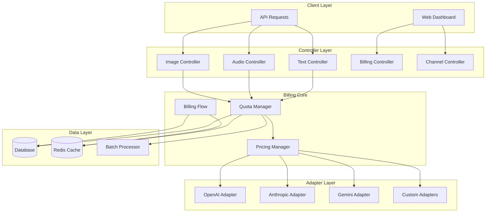
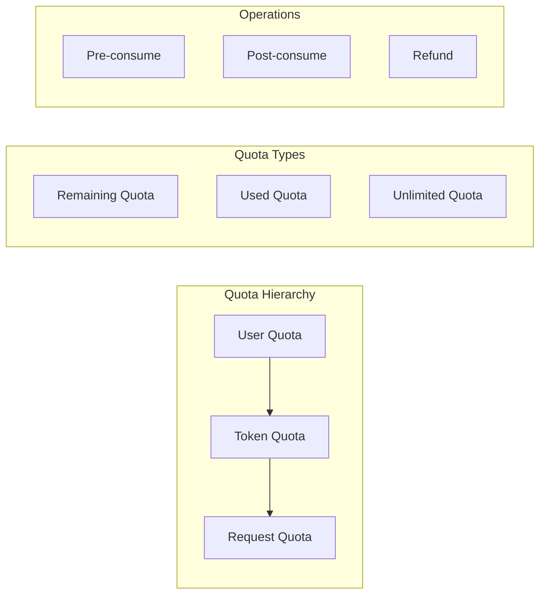
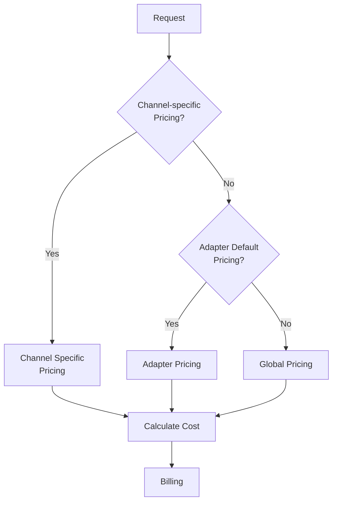
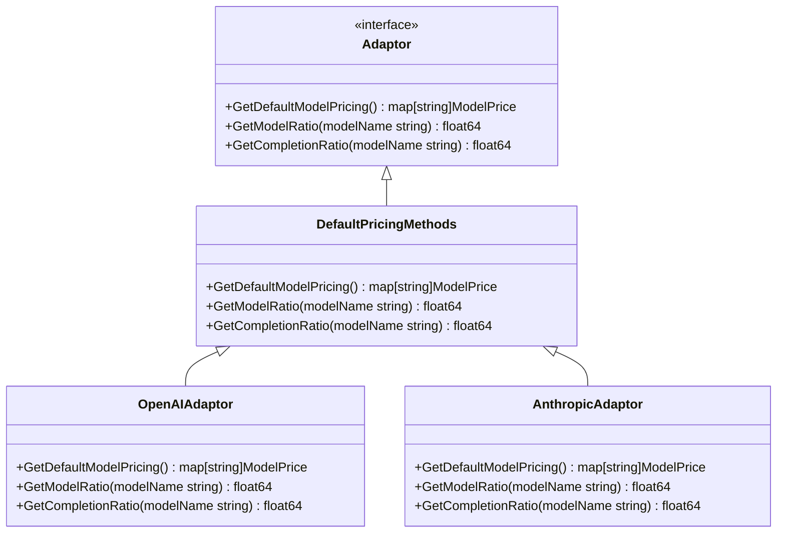
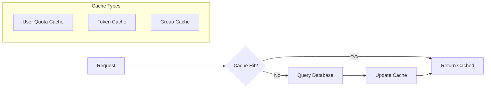
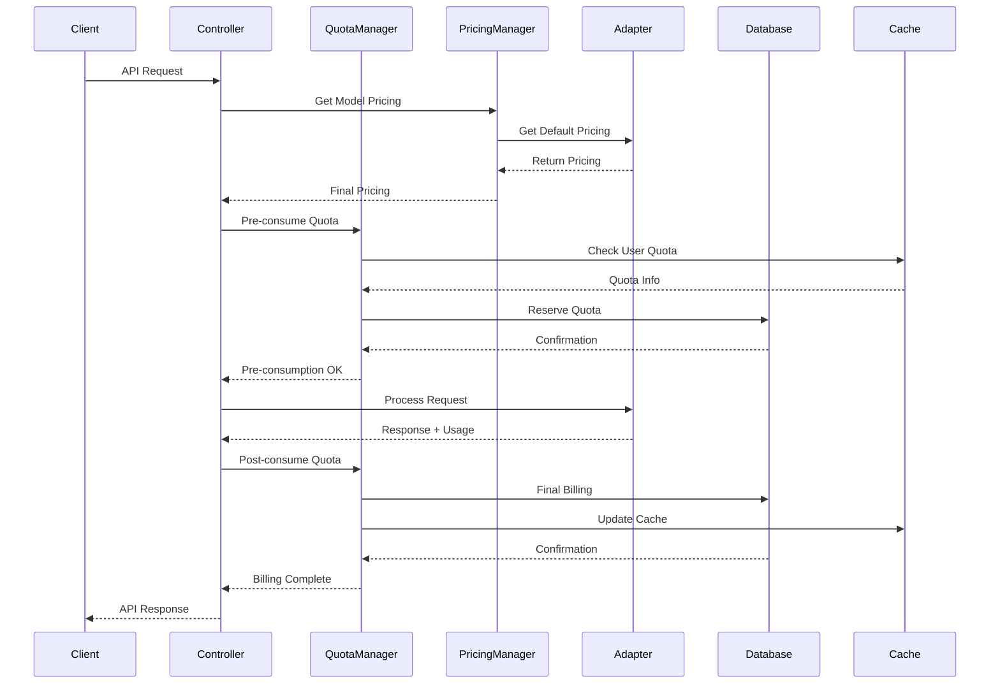
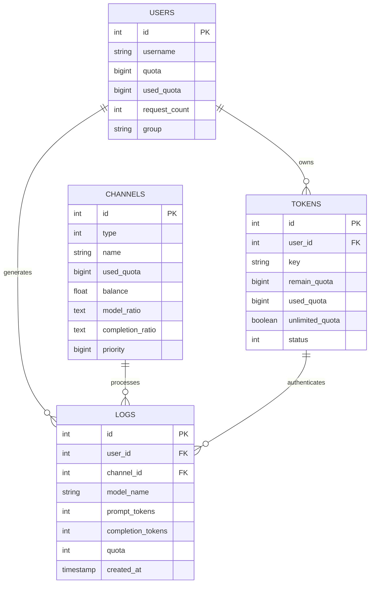

# One-API Billing System Architecture

## Table of Contents

- [One-API Billing System Architecture](#one-api-billing-system-architecture)
  - [Table of Contents](#table-of-contents)
  - [Overview](#overview)
    - [Key Features](#key-features)
  - [System Architecture](#system-architecture)
  - [Core Components](#core-components)
    - [1. Quota Management System](#1-quota-management-system)
      - [Key Files:](#key-files)
    - [2. Pricing System](#2-pricing-system)
      - [Key Files:](#key-files-1)
    - [3. Adapter System](#3-adapter-system)
  - [Quota Management](#quota-management)
    - [User Quota System](#user-quota-system)
      - [Database Schema (User):](#database-schema-user)
      - [Key Operations:](#key-operations)
    - [Token Quota System](#token-quota-system)
      - [Database Schema (Token):](#database-schema-token)
      - [Token Types:](#token-types)
    - [Caching Strategy](#caching-strategy)
      - [Key Files:](#key-files-2)
  - [Pricing System](#pricing-system)
    - [Pricing Hierarchy](#pricing-hierarchy)
    - [Pricing Constants](#pricing-constants)
    - [Model Pricing Structure](#model-pricing-structure)
    - [Channel-specific Pricing](#channel-specific-pricing)
      - [Database Schema (Channel):](#database-schema-channel)
      - [Key Functions:](#key-functions)
  - [Billing Flow](#billing-flow)
    - [Request Processing Flow](#request-processing-flow)
    - [Pre-consumption Phase](#pre-consumption-phase)
      - [Key Functions:](#key-functions-1)
    - [Post-consumption Phase](#post-consumption-phase)
      - [Key Functions:](#key-functions-2)
    - [Quota Calculation](#quota-calculation)
      - [Text Requests:](#text-requests)
      - [Audio Requests:](#audio-requests)
      - [Image Requests:](#image-requests)
  - [Database Schema](#database-schema)
    - [Core Tables](#core-tables)
      - [Users Table](#users-table)
      - [Tokens Table](#tokens-table)
      - [Channels Table](#channels-table)
      - [Logs Table](#logs-table)
    - [Relationships](#relationships)
  - [API Endpoints](#api-endpoints)
    - [Billing Endpoints](#billing-endpoints)
      - [Get Subscription Info](#get-subscription-info)
      - [Get Usage Info](#get-usage-info)
    - [Channel Pricing Endpoints](#channel-pricing-endpoints)
      - [Get Channel Pricing](#get-channel-pricing)
      - [Update Channel Pricing](#update-channel-pricing)
      - [Get Default Pricing](#get-default-pricing)
    - [Token Management Endpoints](#token-management-endpoints)
  - [Implementation Details](#implementation-details)
    - [Pricing Resolution Algorithm](#pricing-resolution-algorithm)
    - [Batch Processing](#batch-processing)
      - [Configuration:](#configuration)
      - [Batch Types:](#batch-types)
      - [Key Files:](#key-files-3)
    - [Error Handling and Recovery](#error-handling-and-recovery)
      - [Quota Refund Mechanism:](#quota-refund-mechanism)
      - [Key Files:](#key-files-4)
    - [Structured Output Pricing](#structured-output-pricing)
      - [Key Files:](#key-files-5)
  - [Performance Considerations](#performance-considerations)
    - [Caching Strategy](#caching-strategy-1)
    - [Database Optimization](#database-optimization)
    - [Memory Management](#memory-management)
    - [Monitoring and Metrics](#monitoring-and-metrics)
      - [Key Metrics:](#key-metrics)
      - [Key Files:](#key-files-6)

## Overview

The One-API billing system is a comprehensive quota and pricing management system designed to handle multi-tenant API usage billing across various AI model providers. The system supports both user-level and token-level quota management, channel-specific pricing, and real-time billing calculations.

### Key Features

- **Multi-tier Quota System**: User quotas, token quotas, and unlimited quota support
- **Channel-specific Pricing**: Per-channel model pricing overrides
- **Adapter-based Pricing**: Each channel adapter manages its own default pricing
- **Real-time Billing**: Pre-consumption and post-consumption quota management
- **Caching Layer**: Redis-based caching for performance optimization
- **Batch Updates**: Configurable batch processing for high-throughput scenarios

## System Architecture



## Core Components

### 1. Quota Management System

The quota management system operates on multiple levels:



#### Key Files:

- `model/user.go` - User quota management
- `model/token.go` - Token quota management
- `model/cache.go` - Quota caching layer
- `relay/billing/billing.go` - Core billing operations

### 2. Pricing System

The pricing system uses a hierarchical approach with multiple fallback levels:



#### Key Files:

- `relay/billing/ratio/model.go` - Global pricing definitions
- `relay/adaptor/interface.go` - Adapter pricing interface
- `relay/adaptor/*/adaptor.go` - Adapter-specific pricing implementations
- `model/channel.go` - Channel-specific pricing storage

### 3. Adapter System

Each channel adapter implements its own pricing logic:



## Quota Management

### User Quota System

Users have a primary quota that serves as the main billing account:

#### Database Schema (User):

```sql
CREATE TABLE users (
    id INTEGER PRIMARY KEY,
    quota BIGINT DEFAULT 0,           -- Remaining quota
    used_quota BIGINT DEFAULT 0,     -- Total used quota
    request_count INTEGER DEFAULT 0   -- Total request count
);
```

#### Key Operations:

- `IncreaseUserQuota()` - Add quota to user account
- `DecreaseUserQuota()` - Deduct quota from user account
- `GetUserQuota()` - Retrieve current user quota
- `CacheGetUserQuota()` - Cached quota retrieval

### Token Quota System

Tokens can have individual quotas or inherit from user quotas:

#### Database Schema (Token):

```sql
CREATE TABLE tokens (
    id INTEGER PRIMARY KEY,
    user_id INTEGER,
    remain_quota BIGINT DEFAULT 0,    -- Token-specific quota
    used_quota BIGINT DEFAULT 0,      -- Token usage
    unlimited_quota BOOLEAN DEFAULT FALSE  -- Bypass quota checks
);
```

#### Token Types:

1. **Limited Tokens**: Have specific quota limits
2. **Unlimited Tokens**: Bypass quota restrictions
3. **User-inherited Tokens**: Use parent user's quota

### Caching Strategy

The system implements a multi-layer caching strategy for performance:



#### Key Files:

- `model/cache.go` - Caching implementations
- Cache TTL configurations in `model/cache.go`

## Pricing System

### Pricing Hierarchy

The system uses a three-tier pricing hierarchy:

1. **Channel-specific Pricing** (Highest Priority)
2. **Adapter Default Pricing** (Medium Priority)
3. **Global Pricing** (Fallback)

### Pricing Constants

```go
// Currency and token conversion constants
const (
    USD2RMB float64 = 7
    QuotaPerUsd float64 = 500000        // $0.002 / 1K tokens
    KiloTokensUsd float64 = QuotaPerUsd / 1000
    MilliTokensUsd float64 = KiloTokensUsd / 1000
    ImageUsdPerPic float64 = QuotaPerUsd / 1000
    VideoUsdPerSec float64 = QuotaPerUsd / TokensPerSec
)
```

### Model Pricing Structure

```go
type ModelPrice struct {
    Ratio           float64 `json:"ratio"`
    CompletionRatio float64 `json:"completion_ratio,omitempty"`
}
```

### Channel-specific Pricing

Channels can override default pricing for specific models:

#### Database Schema (Channel):

```sql
CREATE TABLE channels (
    id INTEGER PRIMARY KEY,
    model_ratio TEXT,        -- JSON: {"model": ratio}
    completion_ratio TEXT    -- JSON: {"model": completion_ratio}
);
```

#### Key Functions:

- `GetModelRatio()` - Retrieve channel model pricing
- `SetModelRatio()` - Update channel model pricing
- `GetCompletionRatio()` - Retrieve completion pricing
- `SetCompletionRatio()` - Update completion pricing

## Billing Flow

### Request Processing Flow



### Pre-consumption Phase

Before processing requests, the system reserves quota:

#### Key Functions:

- `preConsumeQuota()` in `relay/controller/text.go`
- `getPreConsumedQuota()` for quota calculation
- Token validation and quota checking

### Post-consumption Phase

After request completion, final billing is calculated:

#### Key Functions:

- `postConsumeQuota()` in `relay/controller/helper.go`
- `PostConsumeQuota()` in `relay/billing/billing.go`
- Usage logging and metrics recording

### Quota Calculation

Different request types use different calculation methods:

#### Text Requests:

```
quota = (prompt_tokens + completion_tokens * completion_ratio) * model_ratio * group_ratio
```

#### Audio Requests:

```
quota = audio_duration_seconds * audio_tokens_per_second * model_ratio * group_ratio
```

#### Image Requests:

```
quota = image_count * image_cost_per_pic * model_ratio * group_ratio
```

## Database Schema

### Core Tables

#### Users Table

```sql
CREATE TABLE users (
    id INTEGER PRIMARY KEY AUTOINCREMENT,
    username VARCHAR(30) UNIQUE,
    quota BIGINT DEFAULT 0,
    used_quota BIGINT DEFAULT 0,
    request_count INTEGER DEFAULT 0,
    group VARCHAR(32) DEFAULT 'default'
);
```

#### Tokens Table

```sql
CREATE TABLE tokens (
    id INTEGER PRIMARY KEY AUTOINCREMENT,
    user_id INTEGER,
    key CHAR(48) UNIQUE,
    remain_quota BIGINT DEFAULT 0,
    used_quota BIGINT DEFAULT 0,
    unlimited_quota BOOLEAN DEFAULT FALSE,
    status INTEGER DEFAULT 1,
    expired_time BIGINT DEFAULT -1
);
```

#### Channels Table

```sql
CREATE TABLE channels (
    id INTEGER PRIMARY KEY AUTOINCREMENT,
    type INTEGER DEFAULT 0,
    name VARCHAR(255),
    used_quota BIGINT DEFAULT 0,
    balance FLOAT DEFAULT 0,
    model_ratio TEXT,           -- JSON string
    completion_ratio TEXT,      -- JSON string
    priority BIGINT DEFAULT 0
);
```

#### Logs Table

```sql
CREATE TABLE logs (
    id INTEGER PRIMARY KEY AUTOINCREMENT,
    user_id INTEGER,
    channel_id INTEGER,
    model_name VARCHAR(255),
    prompt_tokens INTEGER,
    completion_tokens INTEGER,
    quota INTEGER,
    created_at TIMESTAMP DEFAULT CURRENT_TIMESTAMP
);
```

### Relationships



## API Endpoints

### Billing Endpoints

#### Get Subscription Info

```
GET /dashboard/billing/subscription
GET /v1/dashboard/billing/subscription
```

**Controller**: `controller.GetSubscription()`
**File**: `controller/billing.go`

#### Get Usage Info

```
GET /dashboard/billing/usage
GET /v1/dashboard/billing/usage
```

**Controller**: `controller.GetUsage()`
**File**: `controller/billing.go`

### Channel Pricing Endpoints

#### Get Channel Pricing

```
GET /api/channel/pricing/:id
```

**Controller**: `controller.GetChannelPricing()`
**File**: `controller/channel.go`

#### Update Channel Pricing

```
PUT /api/channel/pricing/:id
```

**Controller**: `controller.UpdateChannelPricing()`
**File**: `controller/channel.go`

#### Get Default Pricing

```
GET /api/channel/default-pricing?type=:channelType
```

**Controller**: `controller.GetChannelDefaultPricing()`
**File**: `controller/channel.go`

### Token Management Endpoints

Token management is handled through existing user and admin endpoints with quota operations integrated.

## Implementation Details

### Pricing Resolution Algorithm

```go
func GetModelRatioWithChannel(modelName string, channelType int, channelRatio map[string]float64) float64 {
    // 1. Check channel-specific pricing
    if channelRatio != nil {
        if ratio, exists := channelRatio[modelName]; exists {
            return ratio
        }
    }

    // 2. Check adapter default pricing
    adapter := GetAdaptor(channelType)
    if adapter != nil {
        return adapter.GetModelRatio(modelName)
    }

    // 3. Fallback to global pricing
    return GetGlobalModelRatio(modelName, channelType)
}
```

### Batch Processing

For high-throughput scenarios, the system supports batch updates:

#### Configuration:

```go
config.BatchUpdateEnabled = true
```

#### Batch Types:

- `BatchUpdateTypeUserQuota` - User quota updates
- `BatchUpdateTypeTokenQuota` - Token quota updates
- `BatchUpdateTypeUsedQuota` - Usage tracking
- `BatchUpdateTypeRequestCount` - Request counting

#### Key Files:

- `model/batch.go` - Batch processing implementation
- Batch operations in `model/user.go` and `model/token.go`

### Error Handling and Recovery

#### Quota Refund Mechanism:

When requests fail, pre-consumed quota is refunded:

```go
func ReturnPreConsumedQuota(ctx context.Context, quota int64, tokenId int) {
    if quota > 0 {
        err := PostConsumeTokenQuota(tokenId, -quota)
        if err != nil {
            logger.Error(ctx, "Failed to return pre-consumed quota: " + err.Error())
        }
    }
}
```

#### Key Files:

- `relay/billing/billing.go` - Quota refund operations
- Error handling in controller files

### Structured Output Pricing

Special handling for structured output requests with additional cost multipliers:

```go
// Apply 25% additional cost for structured output
structuredOutputCost := int64(math.Ceil(float64(completionTokens) * 0.25 * modelRatio))
usage.ToolsCost += structuredOutputCost
```

#### Key Files:

- `relay/adaptor/openai/adaptor.go` - Structured output cost calculation
- Test files: `relay/adaptor/openai/structured_output_*_test.go`

## Performance Considerations

### Caching Strategy

1. **User Quota Caching**: 5-minute TTL for user quota information
2. **Token Caching**: 10-minute TTL for token validation
3. **Group Model Caching**: 30-minute TTL for group permissions

### Database Optimization

1. **Indexes**: Strategic indexing on frequently queried fields
2. **Batch Updates**: Configurable batch processing for write operations
3. **Connection Pooling**: Optimized database connection management

### Memory Management

1. **Pricing Cache**: In-memory caching of pricing information
2. **Model Lists**: Cached model availability per channel
3. **Configuration Cache**: Cached system configuration

### Monitoring and Metrics

The system includes comprehensive monitoring:

#### Key Metrics:

- Request rate and response time
- Quota consumption patterns
- Channel utilization
- Error rates and types

#### Key Files:

- `common/metrics/` - Metrics collection
- Monitoring integration in controller files
